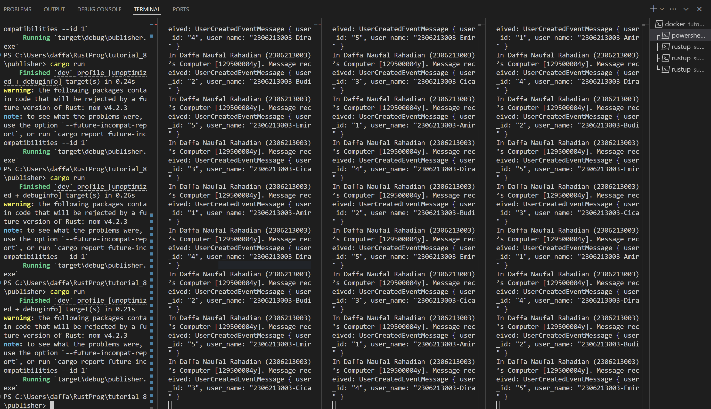
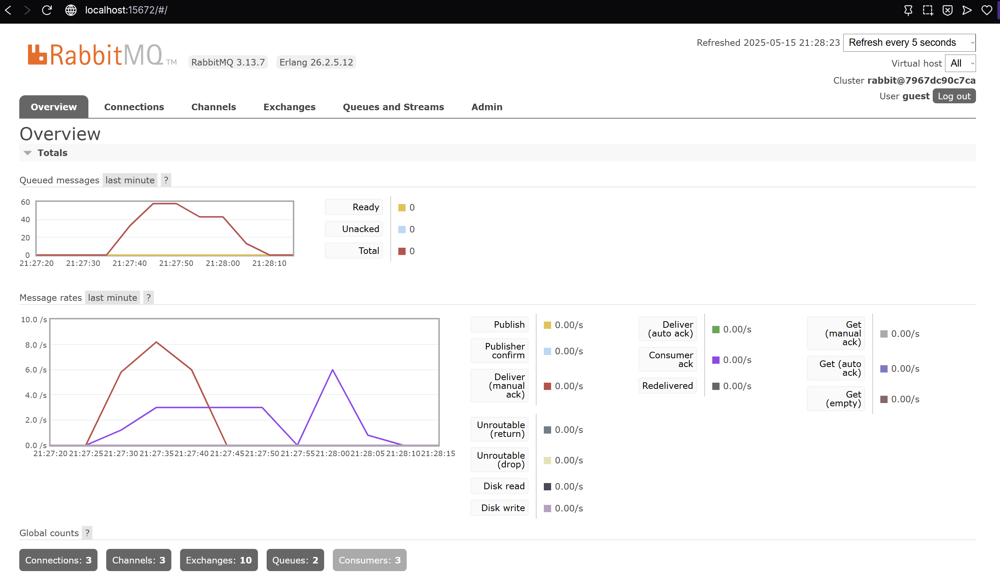

# Tutorial Module 9 - Software Architectures

Nama: Daffa Naufal Rahadian 
NPM: 2306213003

## Refleksi 1
a. What is amqp?
 
AMQP (Advanced Message Queuing Protocol) adalah protokol standar yang digunakan untuk pertukaran pesan antar aplikasi. Protokol ini memungkinkan aplikasi saling berkomunikasi secara tidak langsung lewat perantara seperti message broker (misalnya RabbitMQ). Dengan AMQP, kita bisa mengirim pesan secara andal, mengantri pesan, dan melakukan pola komunikasi seperti publish-subscribe. 

b. What does it mean? guest:guest@localhost:5672 , what is the first guest, and what
is the second guest, and what is localhost:5672 is for?
 
guest:guest@localhost:5672 adalah URI untuk mengakses RabbitMQ menggunakan AMQP. guest pertama adalah username yang digunakan untuk login ke RabbitMQ. guest kedua adalah password untuk username tersebut. localhost:5672 menunjukkan bahwa koneksi ditujukan ke server lokal (localhost) pada port 5672, yaitu port default untuk protokol AMQP.

## Simulation Slow Subscriber

Dalam mesin saya, ada hampir 100 queued messages, ini terjadi ketika Publisher mengirim banyak sekali pesan dalam waktu yang dekat (dalam kasus ini saya coba aktifkan publisher 20 kali dalam waktu di bawah 30 detik) dan penerima pesan (subscriber) tidak dapat memprosesnya dengan cepat (karena ditambah delay). Oleh karena itu pesannya ditampung terlebih dahulu oleh RabbitMQ.

## Reflection and Running at least three subscribers

Setelah dilakukan percobaan dengan 3 subscriber, ada perubahan pada grafik queued messages nya. Dalam kasus ini, telah dilakukan 20 aktivasi Publisher under 30 detik (sama seperti dengan 1 subscriber sebelumnya) dan terlihat queued messages peak ada di bawah 60 dari yang sebelumnya 100. Ini terjadi karena ada lebih dari satu subscriber yang memproses pesan dari RabbitMQ dalam waktu bersamaan, ketiga subscriber itu berbagi pesan yang dikirim dari publisher. Urutan pesan yang mereka proses jadi tidak berurut seperti yang dapat dilihat pada console.

Saat menjalankan program, saya menyadari bahwa setiap subscriber tidak selalu menerima semua pesan yang dikirim. Hal ini terjadi karena secara default, ketiga subscriber tersebut berlangganan ke queue yang sama, sehingga RabbitMQ secara otomatis melakukan load balancing—pesan akan dibagikan secara bergantian ke salah satu subscriber, bukan semuanya sekaligus. Ini cocok jika kita ingin distribusi beban kerja, namun tidak cocok jika semua subscriber harus mendapatkan pesan yang sama.

Untuk membuat agar semua subscriber menerima semua pesan yang sama, perlu ada pengaturan khusus di RabbitMQ, seperti:

Menggunakan exchange bertipe fanout, yang memungkinkan satu pesan disiarkan (broadcast) ke semua queue yang terhubung dengan exchange tersebut.

Setiap subscriber harus memiliki queue-nya sendiri yang unik, dan masing-masing queue tersebut di-bind ke fanout exchange tadi.

Dengan konfigurasi seperti itu, setiap subscriber akan memiliki salinannya sendiri atas setiap pesan yang dikirim oleh publisher, sehingga tidak terjadi rebutan.

Melalui eksperimen ini, saya jadi memahami perbedaan antara load balancing (satu pesan untuk satu subscriber) dan broadcast/fanout (satu pesan untuk semua subscriber), serta pentingnya desain arsitektur queue dan exchange dalam sistem message broker seperti RabbitMQ.