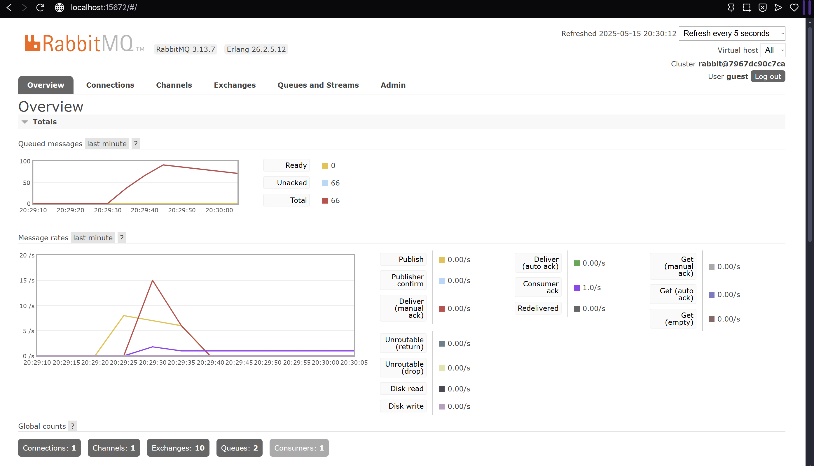

# Tutorial Module 9 - Software Architectures

Nama: Daffa Naufal Rahadian 
NPM: 2306213003

## Refleksi 1
a. What is amqp?
 
AMQP (Advanced Message Queuing Protocol) adalah protokol standar yang digunakan untuk pertukaran pesan antar aplikasi. Protokol ini memungkinkan aplikasi saling berkomunikasi secara tidak langsung lewat perantara seperti message broker (misalnya RabbitMQ). Dengan AMQP, kita bisa mengirim pesan secara andal, mengantri pesan, dan melakukan pola komunikasi seperti publish-subscribe. 

b. What does it mean? guest:guest@localhost:5672 , what is the first guest, and what
is the second guest, and what is localhost:5672 is for?
 
guest:guest@localhost:5672 adalah URI untuk mengakses RabbitMQ menggunakan AMQP. guest pertama adalah username yang digunakan untuk login ke RabbitMQ. guest kedua adalah password untuk username tersebut. localhost:5672 menunjukkan bahwa koneksi ditujukan ke server lokal (localhost) pada port 5672, yaitu port default untuk protokol AMQP.

## Simulation Slow Subscriber

Dalam mesin saya, ada hampir 100 queued messages, ini terjadi ketika Publisher mengirim banyak sekali pesan dalam waktu yang dekat (dalam kasus ini saya coba aktifkan publisher 20 kali dalam waktu di bawah 30 detik) dan penerima pesan (subscriber) tidak dapat memprosesnya dengan cepat (karena ditambah delay). Oleh karena itu pesannya ditampung terlebih dahulu oleh RabbitMQ.